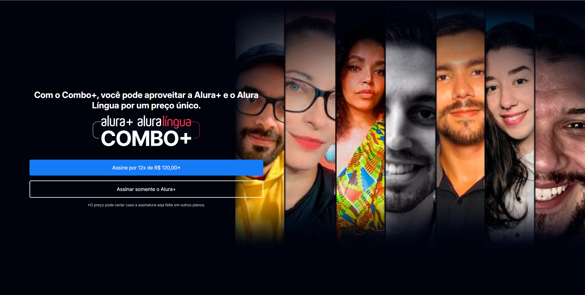
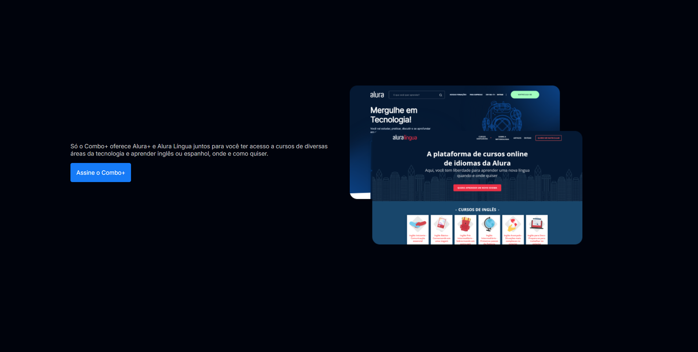
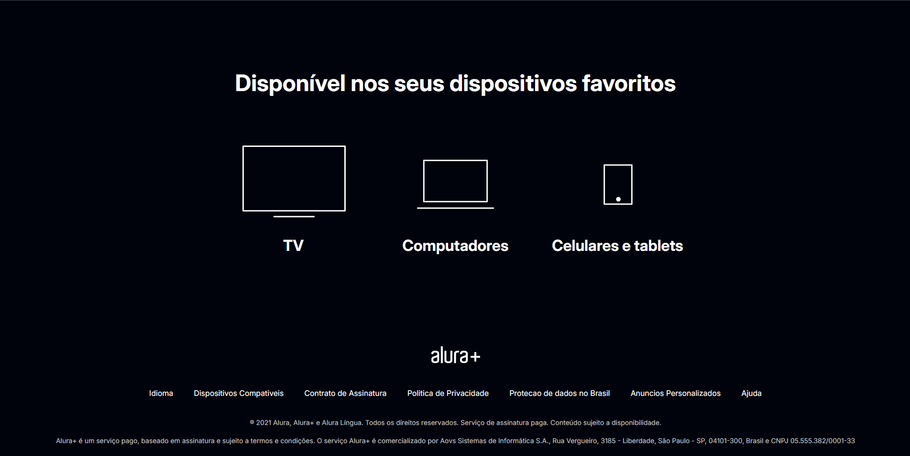

# 🎬 Plataforma de Streaming – Projeto Alura
Este projeto é uma simulação de uma plataforma de streaming, desenvolvido como parte do curso da Alura. O objetivo é aplicar conhecimentos de desenvolvimento web criando uma interface funcional e intuitiva inspirada em serviços de streaming modernos.

## 📚 Sobre o Projeto
Durante o curso, foram abordados conceitos fundamentais de desenvolvimento front-end (e/ou back-end, dependendo do curso), incluindo:

- Estruturação de páginas com HTML

- Estilização com CSS

- Organização de conteúdo em categorias

O projeto final simula uma plataforma onde usuários podem navegar por filmes, séries ou conteúdos organizados em categorias.

## 🛠️ Tecnologias Utilizadas

- HTML5

- CSS3

## 📷 Screenshots

#🎓 Créditos
Projeto desenvolvido durante o curso da [Alura](https://www.alura.com.br/)

Instrutora: Mônica Hillman

📌 Observações
Este projeto foi criado com fins educacionais, para reforçar os fundamentos de HTML e CSS. Melhorias e novas funcionalidades podem ser adicionadas conforme o avanço dos estudos.

